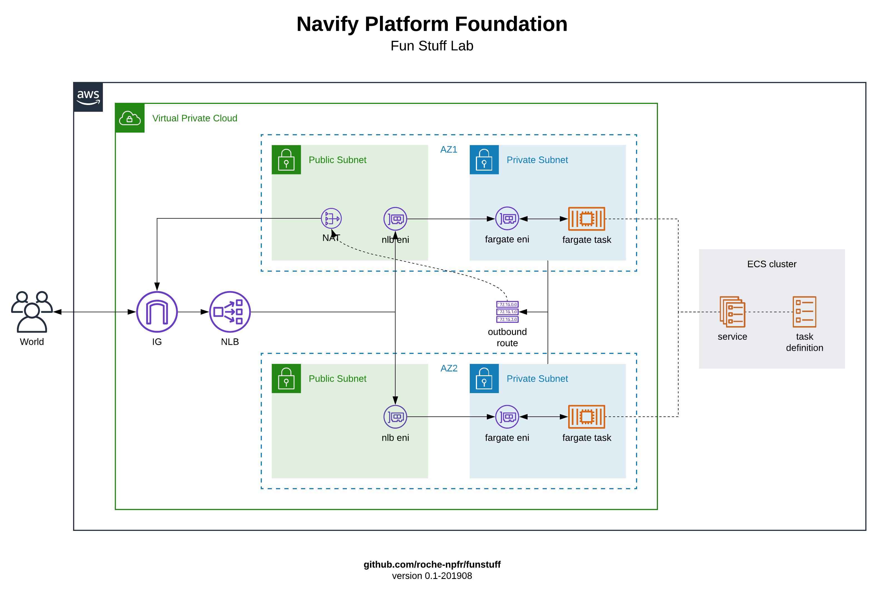

# Hands on Scenario 

# Architecture Diagram

# Scenario overview 
Create the following resources:
  - Four subnets, two public and two private with their respective route tables
  - One ECS Cluster
  - One Fargate task
  - One NLB
